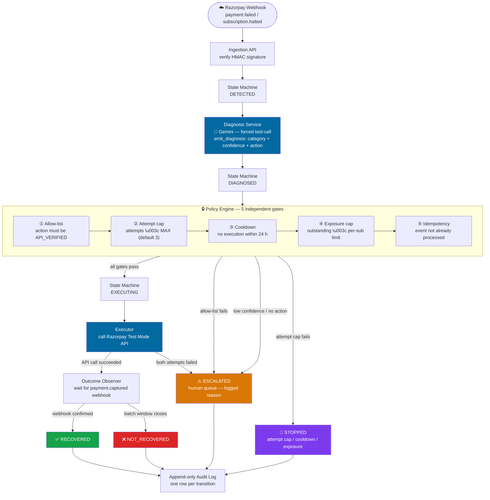

# RecoverFlow — AI Revenue Recovery Orchestrator

Razorpay AI Buildathon · Track 03 — AI Revenue Recovery

A failed-subscription recovery agent. When a Razorpay subscription charge
fails, RecoverFlow detects it, has an LLM diagnose the failure and
recommend a recovery action from a closed allow-list, runs that action
through deterministic policy gates (attempt cap, cooldown, exposure cap,
idempotency), executes it against Razorpay Test Mode only if it has been
verified to actually work, and reports — across a full synthetic batch,
including every escalation and stop — how much revenue was recovered.

Full design rationale lives in [`docs/`](docs/); start with
[`docs/decision.md`](docs/decision.md) (why this track/problem) and
[`docs/product-spec.md`](docs/product-spec.md) (what the system does).

## Why this is narrower than a typical "recovery agent" pitch

[`docs/recovery-feasibility.md`](docs/recovery-feasibility.md) documents
that Razorpay has **no API to force a subscription retry** and **no
confirmed API to change a payment method or re-authorize a mandate** —
both are Dashboard-only or unsupported. The only concretely executable
recovery actions are notification-based (resend an invoice reminder,
or create + notify a Payment Link). The system is built to that
constraint honestly: it never claims an action worked without an
observed Razorpay response, and it never claims a subscription
"recovered" without a later webhook confirming payment.

## Architecture

Single FastAPI service, SQLite for storage, no queues/workers (batch
scale doesn't need them — see
[`docs/architecture.md`](docs/architecture.md) §1). One state machine
(`DETECTED → DIAGNOSED → GATED → {EXECUTING|ESCALATED|STOPPED} →
{RECOVERED|NOT_RECOVERED}`) is the single writer of subscription state;
every transition writes one append-only audit row. The only module that
calls an LLM is the Diagnosis Service; the only module that calls
Razorpay is `razorpay_client`. A static, human-reviewed `actions` table
is the sole source of truth for which actions are safe to run
unattended — the AI recommends from it, a deterministic gate enforces
it, and the Executor independently refuses to run anything not marked
`API_VERIFIED` (defense-in-depth).



## Repo layout

```
backend/    FastAPI app, policy engine, AI diagnosis, tests, synthetic data
frontend/   Vite dashboard: pipeline view, subscription drilldown, metrics, escalation queue
docs/       Every project-phase document, from competition analysis through architecture
```

## Setup

### Backend

```bash
cd backend
python -m venv .venv
.venv\Scripts\activate          # Windows PowerShell: .venv\Scripts\Activate.ps1
pip install -e ".[dev]"
copy .env.example .env          # PowerShell: Copy-Item .env.example .env
```

Edit `backend/.env`:
- `GEMINI_API_KEY` — required for the Diagnosis Service. Get a free key
  at [aistudio.google.com](https://aistudio.google.com) (no billing required).
- `RAZORPAY_KEY_ID` / `RAZORPAY_KEY_SECRET` — **Test Mode keys only**
  (Razorpay Dashboard → Test Mode toggle → Settings → API Keys). Only
  needed once at least one action has been verified (see below) — the
  app runs fine without them, everything just escalates instead of
  executing.
- Everything else has a working default.

Run the tests (no external keys required — the AI/Razorpay calls are
exercised through fakes/mocks in tests that need them):

```bash
python -m pytest -q
```

Run the API:

```bash
uvicorn app.main:app --reload
```

This also seeds the `actions` table on startup (idempotent — never
overwrites a status a human already promoted via the verification spike
below).

### Frontend

```bash
cd frontend
npm install
npm run dev
```

Opens on `http://localhost:5173` (Vite default), talking to the backend
at `http://127.0.0.1:8000` (hardcoded in `frontend/src/api.js` — this is
a local demo tool, not a deployed product).

### Running a demo batch

The frontend only *reads* batches — creating one and feeding it events
happens through the replay script, which signs each synthetic event
exactly as a real Razorpay Test Mode webhook would be signed:

```bash
cd backend
python -m scripts.replay_batch synthetic_data/events_batch_01.json --label "demo batch"
```

This creates a batch, posts all 14 synthetic events through
`POST /webhooks/razorpay` in order, closes the batch (forcing any
still-open subscription to `NOT_RECOVERED`), and prints the metrics
report. Refresh the frontend and select the new batch from the sidebar
to see the pipeline, per-subscription audit trails, escalation queue,
and metrics.

## The capability verification spike (product-spec.md §4.1)

**Before this system can autonomously execute anything, at least one
action must be promoted from `API_ASSUMED` to `API_VERIFIED` by making
one real Test Mode call and observing the result.** Until that happens,
every event correctly routes to `ESCALATED` — this is deliberate, not a
bug (see [`docs/implementation-notes.md`](docs/implementation-notes.md)
§2), but it also means the live pipeline can't yet show
`EXECUTING`/`STOPPED` outside unit tests.

```bash
cd backend
# Self-contained — creates and notifies a real Test Mode Payment Link:
python -m scripts.verify_actions payment_link --promote

# Needs a real invoice_id from your Test Mode account:
python -m scripts.verify_actions invoice --list
python -m scripts.verify_actions invoice --invoice-id inv_XXXXXXXX --promote
```

`--promote` only flips the action's DB row to `API_VERIFIED` if the real
call actually succeeded — it never simulates success. See the script's
docstring for the full spike-then-promote-then-demo workflow.

## Testing

```bash
cd backend && python -m pytest -q
```

34 tests cover the state machine, policy gates (including a
manually-promoted `API_VERIFIED` action so `attempt_cap`/`cooldown`/
`exposure_cap` are exercised independent of whether the live spike has
run), idempotency, diagnosis schema validation, batch metrics
reconciliation, audit logging, and full webhook-to-response integration.

## What broke, and how it was fixed

Documented in full in [`docs/submission.md`](docs/submission.md) for
the application form. Short version: resolving an escalation whose
subscription had already been force-closed by the batch-close sweep
crashed with an unhandled 500 (`state_machine.IllegalTransition`
propagating past the API layer). Caught by writing an integration test
for the batch-close race before it was ever manually hit; fixed by
catching `IllegalTransition` in `POST /escalations/{id}/resolve` and
returning a clean `409 Conflict` instead. Regression test:
`backend/tests/test_api_integration.py::test_batch_close_reconciles_open_escalations_and_resolve_returns_409`.

## Non-goals (explicit)

No real production payment execution, no forced retries or mandate
changes (confirmed unsupported by Razorpay), no multi-channel
notifications, no merchant-facing UI beyond what the demo needs. Full
list in [`docs/product-spec.md`](docs/product-spec.md) §10.
