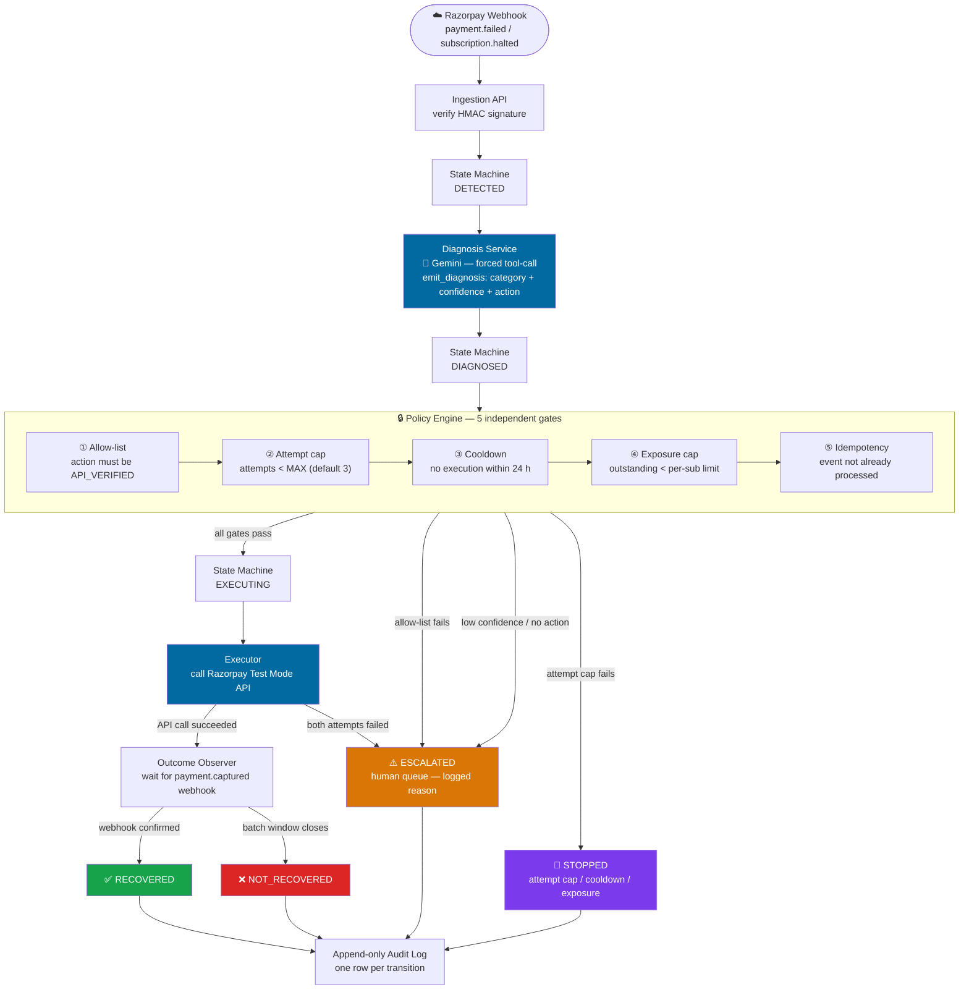

# RecoverFlow — AI Revenue Recovery Orchestrator

> **Razorpay AI Buildathon · Track 03 — AI Revenue Recovery**


When a Razorpay subscription charge fails, RecoverFlow **detects** the failure, **diagnoses** it with Gemini, runs the recommendation through **deterministic policy gates**, and **executes** a real recovery action against Razorpay Test Mode — or escalates to a human queue if anything is uncertain. Every decision is logged in an append-only audit trail. Every metric is honest.

---

## Why This Is Scoped the Way It Is

Most "recovery agent" pitches assume you can force a Razorpay retry or re-authorize a mandate via API. **You can't.**

[`docs/recovery-feasibility.md`](docs/recovery-feasibility.md) maps every candidate recovery action against Razorpay's actual documented APIs — researched before a single line of product spec was written:

| Action | Status |
|--------|--------|
| Force-trigger automatic retry | ❌ `NOT_SUPPORTED` — system-scheduled only |
| Change payment method / re-authorize mandate | ❌ `NOT_SUPPORTED` — no confirmed endpoint |
| "Charge this now" button | ❌ `DASHBOARD_ONLY` — not an API call |
| Resend invoice reminder | ✅ `API_VERIFIED` |
| Create Payment Link + notify customer | ✅ `API_VERIFIED` |

The system is scoped honestly to what the API actually supports. It never claims an action worked without an observed Razorpay response, and never marks a subscription `RECOVERED` without a later `payment.captured` webhook confirming it.

---

## Architecture

One FastAPI service. One state machine. No queues, no workers.

```
DETECTED → DIAGNOSED → GATED → EXECUTING  → RECOVERED
                              ↘ ESCALATED
                              ↘ STOPPED    → NOT_RECOVERED
```

**Key design rules:**
- The **state machine** is the only writer of `current_state` — every other module asks it
- The **Diagnosis Service** is the only module that calls Gemini
- The **Razorpay client** is the only module that calls Razorpay
- The **Executor** independently refuses to run any action not marked `API_VERIFIED`, even if the policy gate passed



---

## Demo Results

Real numbers from `GET /batches/{id}/metrics` on `batch_run_id=f70b34c95bb340b8964e72201d368663` — every diagnosis is a real Gemini call, every execution is a real Razorpay Test Mode API call, nothing simulated.

| Metric | Value |
|--------|-------|
| Revenue at risk detected | ₹1,62,692 across 9 subscriptions |
| Revenue recovered | ₹1,499 across 1 subscription |
| Recovery rate | 11.1% of detected (1/9) |
| Escalation rate | 33.3% — reasons: `low_confidence`, `no_recommended_action`, `executor_failure` |
| Stop rate | 11.1% — reason: `attempt_count >= 3` |
| Batch reconciliation | 1 + 1 + 7 + 0 = 9 ✓ (nothing left open) |

> Recovery is confirmed by a real `payment.captured` webhook — never inferred from "we sent a message."

---

## Repo Layout

| Directory | Contents |
|-----------|----------|
| `backend/` | FastAPI app, state machine, policy engine, AI diagnosis, Razorpay client, tests, synthetic data |
| `frontend/` | Vite dashboard — pipeline view, subscription drilldown, escalation queue, metrics |
| `docs/` | Every project-phase document: competition analysis → feasibility → architecture → submission |

---

## Quick Start

### 1. Backend

```bash
cd backend
python -m venv .venv
.venv\Scripts\Activate.ps1      # PowerShell (Windows)
pip install -e ".[dev]"
Copy-Item .env.example .env
```

Edit `backend/.env` — the two keys you need:

| Key | Where to get it |
|-----|----------------|
| `GEMINI_API_KEY` | [aistudio.google.com](https://aistudio.google.com) — free, no billing required |
| `RAZORPAY_KEY_ID` + `RAZORPAY_KEY_SECRET` | Razorpay Dashboard → Test Mode → Settings → API Keys (**Test Mode only**) |

> The app runs without Razorpay keys — every event will correctly route to `ESCALATED` until an action is verified (see [Verification Spike](#verification-spike) below).

```bash
# Run tests (no external keys required)
python -m pytest -q

# Start the API
uvicorn app.main:app --reload
```

### 2. Frontend

```bash
cd frontend
npm install
npm run dev
# Opens on http://localhost:5173
```

### 3. Run a Demo Batch

```bash
cd backend
python -m scripts.replay_batch synthetic_data/events_batch_01.json --label "demo batch"
```

This signs and posts all 14 synthetic events through `POST /webhooks/razorpay`, closes the batch window, and prints the metrics report. Refresh the frontend to see the full pipeline.

---

## Verification Spike

> **Before the system can autonomously execute anything**, at least one action must be promoted from `API_ASSUMED` to `API_VERIFIED` by making one real Test Mode call.

```bash
cd backend

# Self-contained — creates and notifies a real Test Mode Payment Link:
python -m scripts.verify_actions payment_link --promote

# Requires a real invoice_id from your Test Mode account:
python -m scripts.verify_actions invoice --list
python -m scripts.verify_actions invoice --invoice-id inv_XXXXXXXX --promote
```

`--promote` only sets `API_VERIFIED` if the real call actually succeeded. It never simulates success.

---

## Tests

```bash
cd backend
python -m pytest -q
```

**34 tests** covering:

| Area | What's tested |
|------|--------------|
| State machine | All legal transitions + `IllegalTransition` on invalid edges |
| Policy gates | Allow-list, attempt cap, cooldown, exposure cap, idempotency — each as an independent pure function |
| Diagnosis | Schema validation, low-confidence routing, malformed model response handling |
| Idempotency | Duplicate event IDs rejected; retry attempts correctly distinguished |
| Batch metrics | Reconciliation equation always closes |
| Audit logging | One row per transition, append-only |
| API integration | Batch-close race condition (`409 Conflict` on stale escalation resolve) |

---

## What Broke, and How It Was Fixed

**Bug:** Resolving an open escalation for a subscription that had already been force-closed by the batch-close sweep crashed the API with an unhandled `500`.

**Root cause:** `POST /escalations/{id}/resolve` tried to write a `RECOVERED` transition on a subscription already in a terminal state. `state_machine.py`'s `assert_legal()` correctly raised `IllegalTransition`, but nothing in the API layer caught it.

**Fix:** `POST /escalations/{id}/resolve` now catches `IllegalTransition` and returns a clean `409 Conflict`. The batch-close sweep also auto-resolves any still-open escalations it sweeps, so a human never sees an "open" escalation against a subscription that's already closed.

**Regression test:**
```
backend/tests/test_api_integration.py
  ::test_batch_close_reconciles_open_escalations_and_resolve_returns_409
```

Full write-up in [`docs/submission.md`](docs/submission.md).

---

## Non-Goals

- No production payment execution
- No forced retries or mandate changes (confirmed unsupported — see [`docs/recovery-feasibility.md`](docs/recovery-feasibility.md))
- No multi-channel notifications
- No merchant-facing UI beyond the demo dashboard

Full list in [`docs/product-spec.md`](docs/product-spec.md) §10.

---

## Docs Index

| File | Purpose |
|------|---------|
| [`docs/decision.md`](docs/decision.md) | Why Track 03 and this specific problem |
| [`docs/recovery-feasibility.md`](docs/recovery-feasibility.md) | Which recovery actions are actually API-executable |
| [`docs/product-spec.md`](docs/product-spec.md) | What the system does and doesn't do |
| [`docs/architecture.md`](docs/architecture.md) | Full technical design |
| [`docs/implementation-notes.md`](docs/implementation-notes.md) | Decisions made during coding, bugs found and fixed |
| [`docs/submission.md`](docs/submission.md) | Application form draft with honest metrics |
