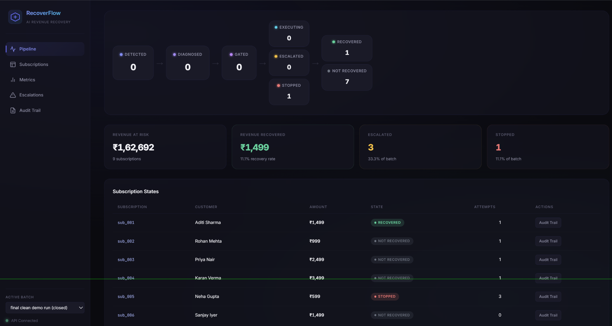

# Application Submission Draft

Status: draft text for the Razorpay AI Buildathon application form
(`docs/hackathon.md`). Everything below can be copied directly into the
form or lightly edited.

---

## Personal details

- **Full name:** Hemanth Katariya
- **College:** IIT Patna
- **Graduation year:** 2027
- **In-person availability from September:** Yes, available from September
- **6 or 12 month preference:** 6 months
- **Resume:** _attach on the form — not tracked in this repo_

---

## Project name

**RecoverFlow**

## Selected track

**Track 03 — AI Revenue Recovery**

## Problem being solved

Razorpay retries a failed subscription charge automatically on its own
schedule, but there is no API to force that retry, no confirmed API to
change a customer's payment method or re-authorize their mandate, and
the one manual "charge now" override is a Dashboard button, not
something software can call. Left alone, a halted subscription is
silent revenue loss — the merchant only finds out when a human happens
to notice, and nobody is systematically measuring how much of that loss
was actually recoverable.

RecoverFlow closes that gap for the one part of it that's genuinely
API-executable: for every failed-subscription webhook, it uses an LLM to
diagnose *why* the charge failed and pick the best-fit recovery action
from a fixed, human-reviewed allow-list; a deterministic policy engine
gates that action against attempt caps, cooldowns, and exposure limits
before anything runs; a verified action is executed against Razorpay
directly; anything unverified, low-confidence, or requiring a human
(e.g. no API exists for it) is routed to an escalation queue instead of
being faked; and a later webhook — never "we sent a message" — is what
actually marks a subscription recovered. Every decision writes one
append-only audit row, and the batch report is honest about how much
was recovered, escalated, and stopped, not just the wins.

*(One line worth saying out loud in the application: we researched
which recovery actions Razorpay Test Mode can actually execute before
writing a line of product spec — see `docs/recovery-feasibility.md` —
and scoped the product to what that research actually supports, rather
than assuming "retry with backoff" or "force a mandate re-auth" were
available and finding out later they weren't.)*

## What broke, and how it was fixed

While building the escalation-resolution flow, resolving an open
escalation for a subscription that had *already* been force-closed by
the batch-close sweep (any subscription still non-terminal when a
batch's window closes is automatically transitioned to
`NOT_RECOVERED` — see `docs/architecture.md` §11) crashed the API with
an unhandled `500` — the resolve endpoint tried to write a
`RECOVERED`/`NOT_RECOVERED` transition on a subscription that was
already terminal, and `state_machine.py`'s `assert_legal()` correctly
raised `IllegalTransition`, but nothing in the API layer caught it.

This was caught by writing an integration test for the race
(`backend/tests/test_api_integration.py::test_batch_close_reconciles_open_escalations_and_resolve_returns_409`)
*before* it was hit manually — deliberately testing the batch-close
sweep's interaction with a still-open escalation, since that's exactly
the kind of "two components both think they own this subscription's
next transition" bug that's easy to miss when each component is tested
in isolation. The fix: `POST /escalations/{id}/resolve` now catches
`IllegalTransition` and returns a clean `409 Conflict` — "this
subscription is already terminal, your escalation is stale" — instead
of an opaque crash. The batch-close step was also made to
auto-resolve any escalations it sweeps, so a human never sees an "open"
escalation against a subscription that's actually already closed.

The broader lesson that shaped the rest of the build: every terminal
state has to be reachable from more than one code path in this system
(a subscription can be closed by the batch window *or* by a human
resolving an escalation *or* by an observed webhook), and every one of
those paths needs to agree, atomically, on what "already terminal"
means — which is why the State Machine module is the single writer of
`current_state` and every other component asks it, rather than each
component tracking its own notion of "done."

## Architecture explanation (for the pitch video / write-up)

See `docs/architecture.md` for the full document. One-paragraph version:
one FastAPI service, no queues or workers (the batch scale here doesn't
need them and it would work against auditability). A single state
machine (`DETECTED → DIAGNOSED → GATED → {EXECUTING|ESCALATED|STOPPED}
→ {RECOVERED|NOT_RECOVERED}`) is the only writer of subscription state,
and every transition writes one append-only audit row. The only module
that calls an LLM is the Diagnosis Service; the only module that calls
Razorpay is `razorpay_client`. A static, human-reviewed `actions` table
is the single source of truth for which recovery actions are safe to
run unattended; the AI recommends from that table, a deterministic
policy engine (allow-list, attempt cap, cooldown, exposure cap,
idempotency — each an independent pure function) gates it, and the
Executor independently refuses to run anything not marked
`API_VERIFIED`, even if the gate were ever wrong.

## Honest metrics (from the final demo batch run)

The §4.1 capability spike has been run for real against Razorpay Test
Mode (`resend_invoice_reminder` and `create_payment_link_and_notify`
are both `API_VERIFIED`, each promoted only after a real call
succeeded — see `docs/implementation-notes.md` §7). The numbers below
are the unedited output of `GET /batches/{id}/metrics` for
`batch_run_id=f70b34c95bb340b8964e72201d368663`
(`python -m scripts.replay_batch synthetic_data/events_batch_01.json`),
so this is the "the agent recovered revenue" claim, not the fallback
one — every number here is a real Gemini diagnosis and/or a real
Razorpay Test Mode API call, never simulated or hand-adjusted.

- **Revenue at risk detected:** ₹1,62,692.00 across 9 subscriptions
- **Revenue recovered:** ₹1,499.00 across 1 subscription — confirmed by
  a real `payment.captured` webhook after a real Payment Link was
  created and its notification sent, never inferred from "action sent"
- **Recovery rate:** 11.1% of detected (1/9), 14.3% of attempted (1/7 —
  "attempted" means the subscription's pipeline actually reached
  `EXECUTING` and made a real Razorpay Test Mode call, whether or not
  that call ultimately succeeded)
- **Escalation rate:** 3 (33.3% of batch), by reason: `low_confidence`
  1, `no_recommended_action` 1, `executor_failure` 1 — the
  `executor_failure` case is a subscription whose diagnosed action
  (`resend_invoice_reminder`) was real and verified, but both retry
  attempts genuinely failed against Razorpay because the synthetic
  event referenced an invoice ID that doesn't exist in Test Mode; the
  system recorded both real failures and escalated cleanly rather than
  faking a success
- **Stop rate:** 1 (11.1% of batch), by reason: `attempt_count=3 >= 3`
  (the attempt-cap gate correctly stopping a subscription that had
  already failed 3 times)
- **Batch size reconciliation:** 1 recovered + 1 stopped + 7
  not_recovered + 0 still_open = 9 total — every subscription in the
  batch is accounted for, none left open

*(Screenshot above is `docs/dashboard.png` — the live operations
dashboard for `batch_run_id=f70b34c95bb340b8964e72201d368663`, the same
run the numbers above are quoted from.)*

One thing worth saying plainly in the application: getting to this
point required diagnosing and fixing two real, previously-undiscovered
bugs that only a genuine `EXECUTING` state could surface — a Razorpay
SDK method-name mismatch (`notify_by` vs `notifyBy`) and a database
unique constraint that omitted a column the Executor's own retry logic
depended on (see `docs/implementation-notes.md` §10 and §9). Both were
found and fixed by actually running the system end-to-end against live
Test Mode APIs, not by code review — which is itself a small argument
for why this project treats "does the demo run for real" as the bar,
not "does it look right."
